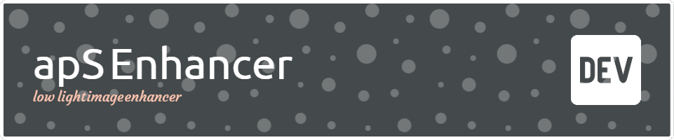
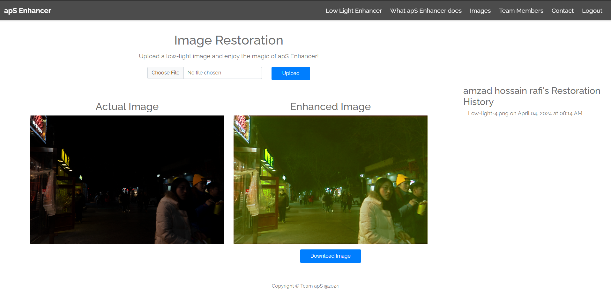
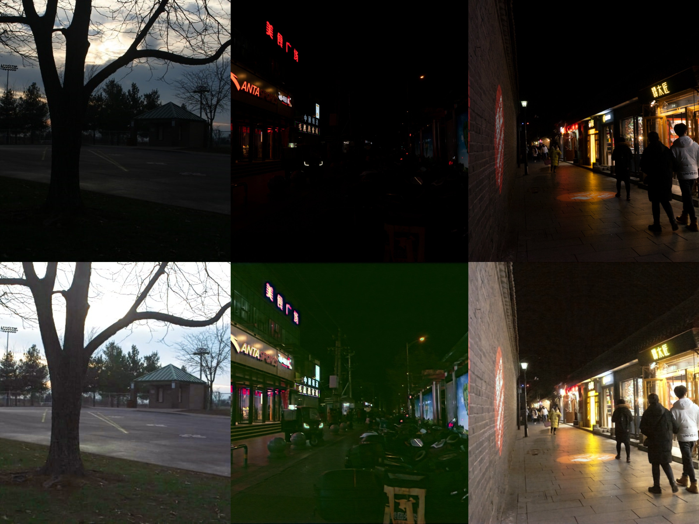

## Project overview : 

This app is designed for enhancing low light images, particularly those taken at night. The underlying model used in this application is capable of improving the resolution of low light images, resulting in clearer and more detailed visuals.

## Web-based Application

This project also includes a web-based application developed using Flask. The web application provides a user-friendly interface for users to upload their low light images and apply the image restoration algorithm. The enhanced images can then be downloaded or shared with others.

To run the web application locally, follow these steps:

1. Install the required dependencies by running the following command in your terminal:
    ```
    pip install -r requirements.txt
    ```
   note : plese make sure install pytoch and torchvision according to your system configuration from [here](https://pytorch.org/get-started/locally/) and also ensure cuda is installed in your system for gpu acceleration which allows faster processing of images. 

2. Start the Flask development server by running the following command:
    ```
    python app.py
    ```

3. Open your web browser and navigate to `http://localhost:5000` to access the application.

Feel free to explore the different features of the web application and experiment with different low light images for restoration.


after uploading the image, the user can click on the "Enhance Image" button to apply the image restoration algorithm. The enhanced image will be displayed on the screen, and the user can choose to download the enhanced image or upload another image for processing.
<br>
<br>



## demo images  


